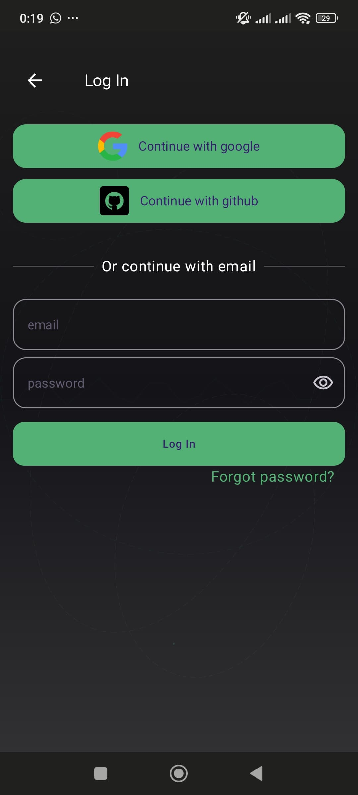
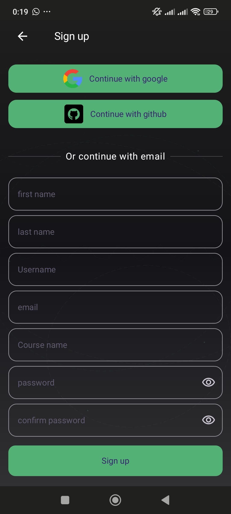

# MeruInnovators Android App

<!-- Logo section with modern CSS -->
<div style="text-align: center;">
  
</div>

<div style="text-align: center; margin-bottom: 20px;">
  <a href="https://github.com/Wamitinewton/must_innovators/stargazers"></a>
  <a href="https://github.com/Wamitinewton/must_innovators/network/members"></a>
  <a href="https://github.com/Wamitinewton/must_innovators/issues"></a>
  <a href="https://github.com/Wamitinewton/must_innovators/blob/main/LICENSE"></a>
  
</div>

## 📱 App Screenshots

<div style="text-align: center; display: flex; flex-wrap: wrap; justify-content: center; gap: 10px; margin-bottom: 20px;">
  
  
  
  
</div>

<div style="text-align: center; display: flex; flex-wrap: wrap; justify-content: center; gap: 10px;">
  
  
  
  
</div>

## 🚀 About

The MeruInnovators app is a platform for the Meru University Science Innovators club that facilitates:

- **Event Management**: Browse, register, and get reminders for upcoming club events
- **Project Showcasing**: Share and discover innovative projects developed by club members
- **Member Networking**: Connect with like-minded individuals through the in-app communication tools
- **Resource Sharing**: Access learning materials, past presentations, and research papers
- **Announcements**: Stay updated with the latest club news and opportunities

## 🛠️ Tech Stack

- **Language**: Kotlin
- **Architecture**: MVVM with Clean Architecture
- **UI**: Jetpack Compose
- **Dependency Injection**: Hilt
- **Database**: Room
- **Networking**: Retrofit, OkHttp
- **Image Loading**: Coil
- **Testing**: JUnit, Espresso, Mockito

## 🔧 Setup & Installation

### Prerequisites

- Android Studio Arctic Fox (2020.3.1) or newer
- JDK 11
- Android SDK 31
- Gradle 7.0+

### Getting Started

1. **Clone the repository**

```bash
git clone https://github.com/Wamitinewton/must_innovators.git
cd must_innovators
```

2. **Configure `keys.properties`**

Create a file named `keys.properties` in the root directory with the following content:

```properties
# Backend API URL
BACKEND_URL=https://your-backend-url.com

# Release signing configuration
RELEASE_STORE_FILE=keystore.jks
RELEASE_STORE_PASSWORD=your_keystore_password
RELEASE_KEY_ALIAS=your_key_alias
RELEASE_KEY_PASSWORD=your_key_alias_password
```

3. **Open in Android Studio**

Open the project in Android Studio and let Gradle sync.

4. **Build and Run**

Connect your device or use an emulator to build and run the app.

## 🔐 Configuring `keys.properties` Details

### Why `keys.properties`?
- Keeps sensitive information (such as API keys and signing credentials) out of version control
- Ensures that contributors can configure their own environment without affecting others
- Prevents accidental exposure of security credentials in public repositories

### Explanation of Properties
- `BACKEND_URL`: The base URL for the backend API
- `RELEASE_STORE_FILE`: Path to the keystore file used for signing the application
- `RELEASE_STORE_PASSWORD`: Password to unlock the keystore file
- `RELEASE_KEY_ALIAS`: Alias name for the key within the keystore
- `RELEASE_KEY_PASSWORD`: Password for the key alias

### Ensure the File is Ignored in Version Control
To prevent accidental commits of sensitive information, make sure `keys.properties` is included in the `.gitignore` file:

```gitignore
keys.properties
```

### How the File is Used in `build.gradle.kts`
The properties are loaded in the build script and used to configure the backend URL and signing configuration:

```kotlin
val properties = Properties()

try {
    val keystoreFile = rootProject.file("keys.properties")
    if (keystoreFile.exists()) {
        properties.load(keystoreFile.inputStream())
    } else {
        throw GradleException("keys.properties file not found")
    }
} catch (e: Exception) {
    logger.warn("Warning: ${e.message}")
}

// Access and use the properties
val backendUrl = properties.getProperty("BACKEND_URL")
    ?: throw GradleException("BACKEND_URL not found in keys.properties")

buildConfigField("String", "BACKEND_URL", "\"$backendUrl\"")
```

### Troubleshooting
- **Error: `keys.properties file not found`**  
  Ensure that `keys.properties` is present in the root directory.
- **Error: `Property XYZ not found in keys.properties`**  
  Verify that the required property exists and is correctly formatted.
- **Error: `Incorrect keystore or password`**  
  Check if the keystore file exists and the credentials are correct.

## 👥 How to Contribute

We welcome contributions from everyone! Here's how you can help:

### 1. Find an Issue

- Check out the [issues tab](https://github.com/Wamitinewton/must_innovators/issues) for open tasks
- Look for issues tagged with `good first issue` if you're new
- Feel free to ask questions on any issue you're interested in

### 2. Fork & Create a Branch

```bash
# Fork using GitHub website

# Clone your fork
git clone https://github.com/your-username/must_innovators.git

# Create a branch
git checkout -b feature/your-feature-name
```

### 3. Make Changes & Test

- Implement your changes
- Add tests where appropriate
- Ensure all tests pass
- Check code style and formatting

### 4. Commit & Push

```bash
git add .
git commit -m "feat: add your meaningful commit message"
git push origin feature/your-feature-name
```

### 5. Submit a Pull Request

- Go to your fork on GitHub
- Click "New Pull Request"
- Select your branch and submit
- Add a clear description of your changes

### Coding Guidelines

- Follow Kotlin coding conventions
- Use meaningful variable and function names
- Write comments for complex logic
- Add documentation for public APIs
- Keep functions small and focused

## 📋 Requirements for Contribution

- Ensure your code compiles without warnings
- Maintain test coverage
- Follow the existing architectural patterns
- Update documentation if needed
- Add screenshots for UI changes in your PR description

## 📝 License

This project is licensed under the MIT License - see the [LICENSE](LICENSE) file for details.

## 🙏 Acknowledgements

- Meru University Science Department for their support
- All contributors who have helped shape this project
- Open source libraries that made this project possible
